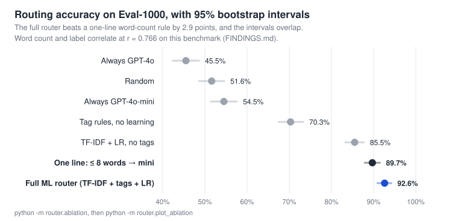

# Dual LLM System

**A cascade router that sends each chat query to GPT-4o-mini or GPT-4o, plus an
honest ablation of why it works.** A word-count pre-flight, a TF-IDF + logistic
regression router, and a GPT-4o-mini classifier fallback pick the model; SQLite
user profiles and a sliding-window memory personalize the answer.


[](LICENSE)



Built at Northeastern University as a course project with **Zichen Qi** and
**Yalin Sun**; their original report is in [`paper/archive/`](paper/archive/).
The follow-up ablation in [FINDINGS.md](FINDINGS.md) and the current paper in
[`paper/`](paper/) are by Sandeep Vijayarao.

---

## What it does

Most LLM apps send every query to the most expensive model, even `"hi"`. This
system routes each query through a 3-layer cascade: cheap queries go to
GPT-4o-mini, hard ones to GPT-4o, and the expensive classifier only runs when
the offline router is unsure. It also keeps a per-user profile and a bounded
conversation memory, and only sends the profile when the query needs it.

## Key numbers, and what they mean

All from the committed model on Eval-1000 (1,000 author-labelled queries, 23
categories). Reproduce with `python -m router.eval_1000` and
`python -m router.ablation`.

| Metric | Value | Read it as |
|---|---|---|
| ML router accuracy | **92.6%** (95% CI 90.9–94.2) | small vs big, against the labels |
| One-line baseline: `len(query.split()) <= 8` → small | **89.7%** (95% CI 87.9–91.5) | only 2.9 points behind; intervals overlap |
| Queries the ML router decides alone | **85.3%** | the other 14.7% also cost one GPT-4o-mini classifier call |
| Queries sent to GPT-4o | **49.5%** | this drives serving cost; the labels say 45.5% need it |
| Seed training set | **239** examples | |

**What the ablation found** ([FINDINGS.md](FINDINGS.md)):

- The router's gain over plain TF-IDF (+7.1 points) comes almost entirely from
  the three **length** tags (+6.9). The thirteen semantic tags (reasoning
  keywords, code, math and so on) add +0.4 points, which is noise.
- The reason is the benchmark: word count and the `big` label correlate at
  **r = 0.766**, because one annotator wrote both the queries and the labels.
  The label flips almost deterministically at nine words.
- On the 103 queries where the word-count rule is wrong, the router is at
  chance (52.4%).

So the cascade works as engineering (it routes, falls back, logs and stays
cheap), but this benchmark cannot show that the semantic features matter. The
next step is a length-stratified eval set; see "Path B" in FINDINGS.md.

---

## Architecture

```
User Query
    │
    ▼
┌─────────────────────────────────────────────────────────┐
│  LAYER 0 — Pre-flight check                             │
│  query > 2000 words? → skip everything → Large LLM      │
└─────────────────────────────────────────────────────────┘
    │
    ▼
┌─────────────────────────────────────────────────────────┐
│  LAYER 1 — ML Router  (offline, ~0ms, no API call)      │
│  TF-IDF (1-3 grams, 5000 features)                      │
│  + 16 hand-crafted feature tags                         │
│  + Logistic Regression (balanced class weights)         │
│                                                         │
│  confidence ≥ 0.65 → use decision directly              │
│  confidence < 0.65 → cascade to Layer 2                 │
└─────────────────────────────────────────────────────────┘
    │ low confidence (~15% of queries)
    ▼
┌─────────────────────────────────────────────────────────┐
│  LAYER 2 — LLM Classifier  (GPT-4o-mini, JSON mode)    │
│  Returns: complexity, intent, confidence,               │
│           requires_tools, sensitive,                    │
│           routing_decision, profile_relevant            │
│                                                         │
│  confidence < 0.75 → force "big"                        │
│  parse failure     → default "big"                      │
└─────────────────────────────────────────────────────────┘
    │
    ├─── "small" ──────────────────────────────────────────►  GPT-4o-mini
    │    + profile context (if profile_relevant=true)          SimpleAnswerer
    │    + name stub (always, for greeting personalization)     ≤ 512 tokens
    │
    └─── "big" ────────────────────────────────────────────►  GPT-4o
         Step 1: Reasoner (core answer, audience hint)         ≤ 4096 tokens
         Step 2: Summarizer → 1-line summary (GPT-4o-mini)
         Step 3: Personalizer → intro + closing (GPT-4o-mini)
         Step 4: Assemble: intro + core + "---" + closing
```

---

## Feature Engineering (ML Router Tags)

The ML router encodes each query as a tag-augmented string before TF-IDF. On
Eval-1000 only the three `LEN_*` tags carry measurable signal; the rest add
+0.4 points combined, and `LEN_LONG`, `Q_MULTI` and `MULTI_SENTENCE` never fire
(FINDINGS.md section 2). They are kept because a less length-confounded
benchmark may need them.

```
encode_text("why is the sky blue?")
→ "LEN_SHORT HAS_REASONING_KW Q_SINGLE why is the sky blue?"
```

| Tag | Signal | Routing hint |
|---|---|---|
| `LEN_SHORT` | ≤ 8 words | → small |
| `LEN_MEDIUM` | 9–40 words | neutral |
| `LEN_LONG` | > 40 words | → big |
| `HAS_CODE` | `` ``` ``, `def `, `class `, `import ` | → big |
| `HAS_MATH` | digits+ops, `\int`, `\sum` | → big |
| `HAS_REASONING_KW` | why, how, compare, prove, explain, analyze… | → big |
| `HAS_FACTUAL_KW` | what is, who is, when did, define… | → small |
| `HAS_GREETING_KW` | hi, hello, thanks… | → small |
| `HAS_CREATIVE_KW` | joke, poem, story, haiku, pun… | → small |
| `HAS_OPINION_KW` | best, vs, should I, pros and cons… | → big |
| `HAS_DEEP_WHAT` | "what is" + >5 words (abstract) | → big |
| `HAS_IMPACT_KW` | impact, effect, consequence… | → big |
| `HAS_RESEARCH_KW` | research, literature, studies show… | → big |
| `HAS_SELF_REF` | my name, who am I, about me… | → profile inject |
| `Q_MULTI` | 2+ question marks | → big |
| `MULTI_SENTENCE` | 3+ sentence-ending chars | → big |

---

## ML Router Evaluation Results

### 1000-Case Evaluation

```
Overall Accuracy  : 92.6%
Cascade Rate      : 14.7%   (queries that also get the GPT-4o-mini classifier)
ML decides alone  : 85.3%
Sent to GPT-4o    : 49.5%

Confusion Matrix (positive = 'big'):
  TP = 438   FN = 17
  FP = 57    TN = 488

  Precision : 0.885
  Recall    : 0.963
  F1        : 0.922
```

### Per-Category Accuracy

| Category | Accuracy | Cascade Rate |
|---|---|---|
| analysis | 100% | 5.6% |
| career_learning | 100% | 0.0% |
| comparison_technical | 100% | 6.7% |
| compound_questions | 100% | 2.0% |
| conversions | 100% | 45.0% |
| definitions | 100% | 0.0% |
| domain_specific_deep | 100% | 0.0% |
| math_simple | 100% | 32.7% |
| multi_constraint | 100% | 20.0% |
| proofs | 100% | 10.0% |
| real_world_planning | 100% | 16.0% |
| research_synthesis | 100% | 0.0% |
| short_creative | 100% | 11.1% |
| system_design | 100% | 0.0% |
| factual | 96.1% | 7.9% |
| yes_no | 95.6% | 26.7% |
| ambiguous | 90.0% | 15.0% |
| greetings | 93.8% | 15.6% |
| conversational | 80.0% | 26.7% |
| ethical_philosophical | 75.0% | 20.0% |
| debug_simple | 33.3% | 24.4% *(next target)* |

### v0 vs v1, and why that comparison is not an ablation

The original write-up compared v0 (120 examples, unigrams, 88.2% on Eval-500)
against v1 (239 examples, 1–3 grams, tags, 92.6% on Eval-1000). That changes
four things at once, including the eval set, and 11% of Eval-500 overlaps the
training data. The controlled version, holding everything but one factor fixed,
is in [FINDINGS.md](FINDINGS.md) section 1.

Run the evaluation yourself:
```bash
python -m router.eval_500   # 500 labeled cases
python -m router.eval_1000  # 1000 labeled cases (with before/after table)
python -m router.ablation   # controlled ablation + baselines -> router/ablation_results.json
python -m router.plot_ablation  # redraw docs/router_vs_baselines.svg
```

---

## Personalization System

### User Profiles (SQLite)

Each user has a persistent profile that evolves after every session:

```json
{
  "name": "Alex",
  "expertise": "intermediate",
  "tone": "casual",
  "domain": "Computer Science",
  "interests": ["algorithms", "web development", "machine learning basics"],
  "topics_discussed": ["OOP", "recursion", "REST APIs", "databases"],
  "preferred_format": "bullets",
  "background": "Third-year CS undergraduate...",
  "interaction_count": 5
}
```

**Profile injection rules:**
- `profile_relevant=true` → full profile embedded in user message as `[User context]` block
- `profile_relevant=false` + has name → name-only stub injected (greetings say "Hey Alex!")
- `profile_relevant=false` + no name → no profile sent (pure query to model)
- Self-referential queries (`"what is my name"`, `"what are my interests"`) → always inject regardless of classifier decision

### Conversation Memory (ConversationBuffer)

Per-user sliding window prevents unbounded context growth:

```
Turn 4 (oldest)  ──► evicted → compressed into rolling_summary (≤80 tokens)
Turn 5           ──┐
Turn 6           ──┤  verbatim window (last 3 turn-pairs)
Turn 7 (current) ──┘

History sent to model:
  [system]: [Earlier summary: Alex asked about recursion, REST APIs...]
  [user/asst]: turns 5-7 verbatim
  [user]: current query
```

Configure window size: `CONVERSATION_WINDOW_SIZE=3` in `.env`

---

## Slash Commands

Force a model directly without any routing logic:

| Command | Effect |
|---|---|
| `/large <query>` | Skip all routing → GPT-4o directly |
| `/small <query>` | Skip all routing → GPT-4o-mini directly |

Examples:
```
/large explain the CAP theorem in distributed systems
/small what is 2+2
/large    ← empty query also works
```

Routing badge shows `⚡ Forced → Large LLM (GPT-4o)` in the UI.

---

## Prompt Visibility

Every response in the UI has two expanders:

- **🔍 Routing Details** — routing decision, model used, latency, ML prediction, classifier JSON, buffer state
- **📤 Prompts Sent to Models** — exact system prompt + user message sent to each model call (Reasoner, Summarizer, Personalizer, or SimpleAnswerer)

---

## Routing Log and Retraining

Every routing decision is logged to `routing_log.db`:

```sql
routing_events (ts, user_id, query, ml_decision, ml_confidence,
                llm_decision, llm_confidence, final_routing, model_used)
```

Retraining is a manual step: export the rows where the ML router and the LLM
classifier agreed, then retrain.

```bash
# Export rows where ML + LLM agreed (highest-quality labels)
python -c "
from router.classification_logger import ClassificationLogger
log = ClassificationLogger('routing_log.db')
n = log.export_labeled_csv('real_traffic.csv')
print(f'Exported {n} rows')
"

# Retrain on seed data + real traffic
python -m router.train --extra real_traffic.csv
```

---

## Quick Start

### Prerequisites

- Python 3.11+ (scikit-learn 1.8 needs it)
- OpenAI API key

### Setup

```bash
# 1. Clone the repo
git clone https://github.com/sandeepvijayarao09/dual-llm-system.git
cd dual-llm-system

# 2. Create virtual environment
python -m venv venv
source venv/bin/activate        # macOS/Linux
# venv\Scripts\activate         # Windows

# 3. Install dependencies
pip install -r requirements.txt

# 4. Configure environment
cp .env.example .env
# Edit .env — set OPENAI_API_KEY=your_key_here

# 5a. Launch Streamlit UI
streamlit run app.py

# 5b. Or use the CLI
python main.py --user cs_student --verbose
```

### Tests

```bash
pytest -q        # 38 tests, no API key needed (LLM calls are faked)
```

CI runs the tests on Python 3.11 and 3.12 and checks that the 1000-case eval
still reproduces from the committed model.

### CLI Options

```bash
python main.py                          # guest mode
python main.py --user cs_student        # load saved profile
python main.py --user cs_student --verbose  # show routing metadata
python main.py --demo                   # run 5 demo queries
python main.py --user cs_student --show-profile  # print profile and exit
```

### Pre-seeded Personas

| User ID | Name | Expertise | Domain |
|---|---|---|---|
| `cs_student` | Alex | Intermediate | Computer Science |
| `nasa_engineer` | Dr. Sarah Chen | Expert | Aerospace / Embedded Systems |
| `high_school` | Jordan | Novice | High School / General |

---

## Project Structure

```
dual-llm-system/
├── app.py                      # Streamlit web UI
├── main.py                     # CLI entry point
├── orchestrator.py             # Central routing engine
├── config.py                   # All configuration + env vars
├── requirements.txt
│
├── llm/
│   ├── small_llm.py            # GPT-4o-mini client
│   └── large_llm.py            # GPT-4o client
│
├── modules/
│   ├── classifier.py           # LLM-based query classifier
│   ├── answerer.py             # Simple query handler (Small LLM)
│   ├── reasoner.py             # Deep reasoning handler (Large LLM)
│   ├── personalizer.py         # Intro/closing wrapper (Small LLM)
│   └── profile_updater.py      # Session-end profile extractor
│
├── router/
│   ├── features.py             # Hand-crafted feature tags + encode_text()
│   ├── ml_router.py            # TF-IDF + LogisticRegression pipeline
│   ├── train.py                # Training script
│   ├── seed_data.py            # 239 labeled training examples
│   ├── classification_logger.py # SQLite log for retraining
│   ├── eval_500.py             # 500-case evaluation script
│   ├── eval_1000.py            # 1000-case evaluation script
│   ├── ablation.py             # controlled ablation behind FINDINGS.md
│   ├── plot_ablation.py        # draws docs/router_vs_baselines.svg
│   └── models/
│       └── router_v0.joblib    # Trained model (saved pipeline)
│
├── memory/
│   └── conversation_buffer.py  # Sliding window + rolling summary
│
├── db/
│   └── profile_db.py           # SQLite CRUD for user profiles
│
├── tests/                      # pytest, no API key needed
├── paper/                      # NeurIPS-format paper (main.tex, main.pdf)
├── FINDINGS.md                 # controlled ablation and the length confound
└── presentation.html           # Reveal.js deck from the course presentation (predates FINDINGS.md)
```

---

## Configuration

All settings are in `.env` (copy from `.env.example`):

| Variable | Default | Description |
|---|---|---|
| `OPENAI_API_KEY` | required | OpenAI API key |
| `LARGE_MODEL` | `gpt-4o` | Model for complex queries |
| `SMALL_MODEL` | `gpt-4o-mini` | Model for simple queries + all support tasks |
| `CONFIDENCE_THRESHOLD` | `0.75` | Min LLM classifier confidence to trust "small" |
| `LARGE_INPUT_THRESHOLD` | `2000` | Word count to bypass classification |
| `ML_ROUTER_CONFIDENCE_THRESHOLD` | `0.65` | Min ML router confidence before LLM fallback |
| `ENABLE_ML_ROUTER` | `true` | Enable/disable ML router (falls back to LLM only) |
| `ML_ROUTER_PATH` | `router/models/router_v0.joblib` | Path to trained model |
| `ROUTING_LOG_PATH` | `routing_log.db` | SQLite log for retraining data |
| `CONVERSATION_WINDOW_SIZE` | `3` | Turn-pairs kept verbatim in memory |
| `SMALL_LLM_TIMEOUT` | `60` | API timeout in seconds |
| `LARGE_LLM_TIMEOUT` | `120` | API timeout in seconds |
| `DB_PATH` | `profiles.db` | User profile database path |

---

## Retrain the ML Router

```bash
# Train on seed data only
python -m router.train

# Train with additional real-traffic data
python -m router.train --extra my_data.csv

# CSV format for --extra:
# query,label
# "What is HTTP?",small
# "Design a URL shortener",big
```

---

## Tech Stack

| Layer | Technology |
|---|---|
| Small LLM | GPT-4o-mini (OpenAI) |
| Large LLM | GPT-4o (OpenAI) |
| ML Router | scikit-learn — TF-IDF + Logistic Regression |
| Web UI | Streamlit |
| Profile DB | SQLite (raw, no ORM) |
| Routing Log | SQLite (ClassificationLogger) |
| Config | python-dotenv |
| Model persistence | joblib |

---

## Design Principles

1. **Large LLM never sees full profile** — only a lightweight audience hint. Personalization (intro/closing) is handled by the Small LLM after reasoning is complete.

2. **Large LLM output never goes directly to Small LLM** — compressed to 1 sentence first to prevent context overflow.

3. **Profile injection is conditional** — the classifier decides `profile_relevant` per query. Math, greetings, and universal facts skip profile injection entirely.

4. **Self-referential queries always get profile** — `"what is my name"` is detected by `_is_self_referential()` and always receives profile data regardless of classifier decision.

5. **Conservative routing** — when uncertain, always escalate to the better model. Three independent safety gates (pre-flight, confidence threshold, parse failure fallback).

6. **Every routing decision is logged** — so real traffic can be exported as labels and the router retrained (a manual step today).

---

## License

MIT License — see [LICENSE](LICENSE) for details.
